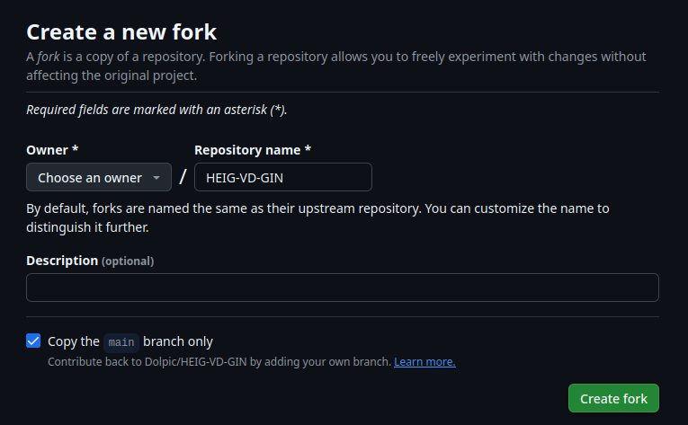

# Exercice 1

## Les forks

Vous trouvez un code intéressant sur un repository git (par exemple, ce cours sur GitHub). Vous pouvez cloner ce code sur votre machine, mais vous ne pouvez pas *push* vos modifications car vous n'avez pas le droit de modifier le repository original.

Vous souhaitez donc créer votre propre copie du repository, dans votre compte GitHub, afin de pouvoir le modifier comme bon vous semble. C'est ce qu'on appelle un *fork*.

Pour *fork* un repository, il vous suffit d'aller sur la page GitHub du projet, ici https://github.com/Dolpic/HEIG-VD-GIN et de cliquer sur le bouton "fork" en haut à droite    
Vous arrivez sur un page vous demandant de sélectionner le compte dans lequel vous souhaitez faire la copie. 

Sélectionner votre compte, puis "Create fork". Vous arrivez ensuite sur un nouveau repository, identique à l'original, mais stocker sur votre compte.

Cloner ce repository sur votre machine, et poursuivez les exercices depuis ce nouveau repository. Vous pourrez alors `git commit` et `git push` votre progrès au fur et à mesure.